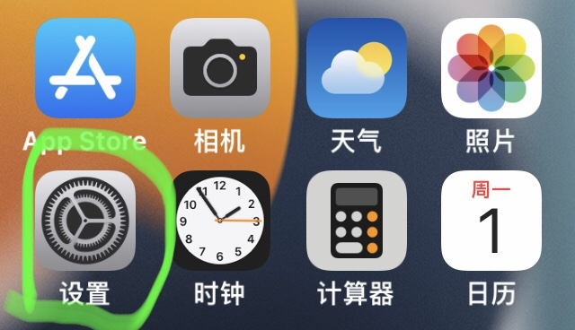
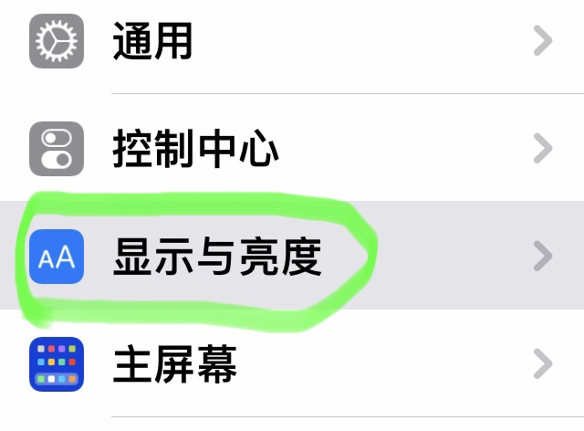
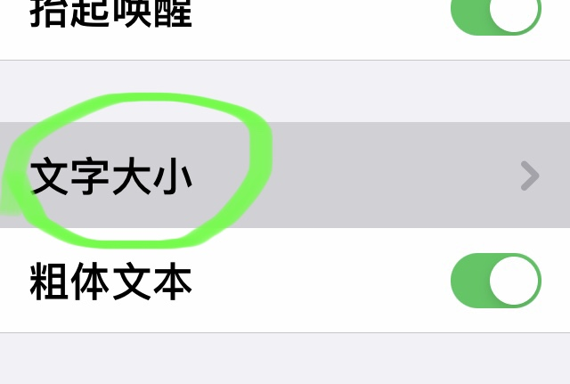
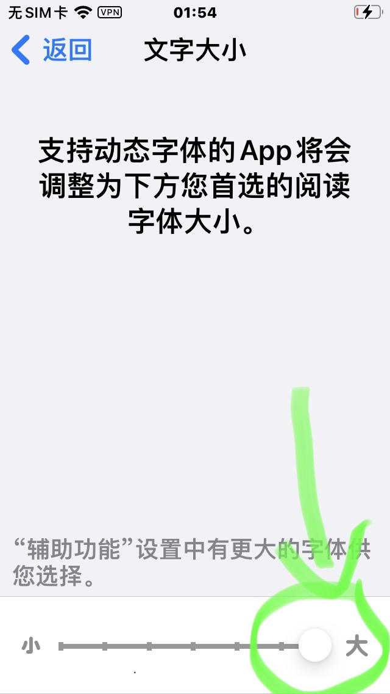

苹果手机的设置一般都在 **"设置"** 中，而苹果手机系统字体大小的设置，就在 **"设置"** > **"显示与亮度"** > **"字体大小"** 中设置.

1. 首先打开 **"设置"**
   
2. 找到 **"显示与亮度"** 并且点击进入
   
3. 找到 **"字体大小"** 进入设置页面
   
4. 在页面的最下面，有一个可与拖动的圆形滑块，向右拖动字体变大，向左拖动字体变小
   

在上述调整的同时，可以看到屏幕上面的字在随之变化，选择合适的大小即可。
