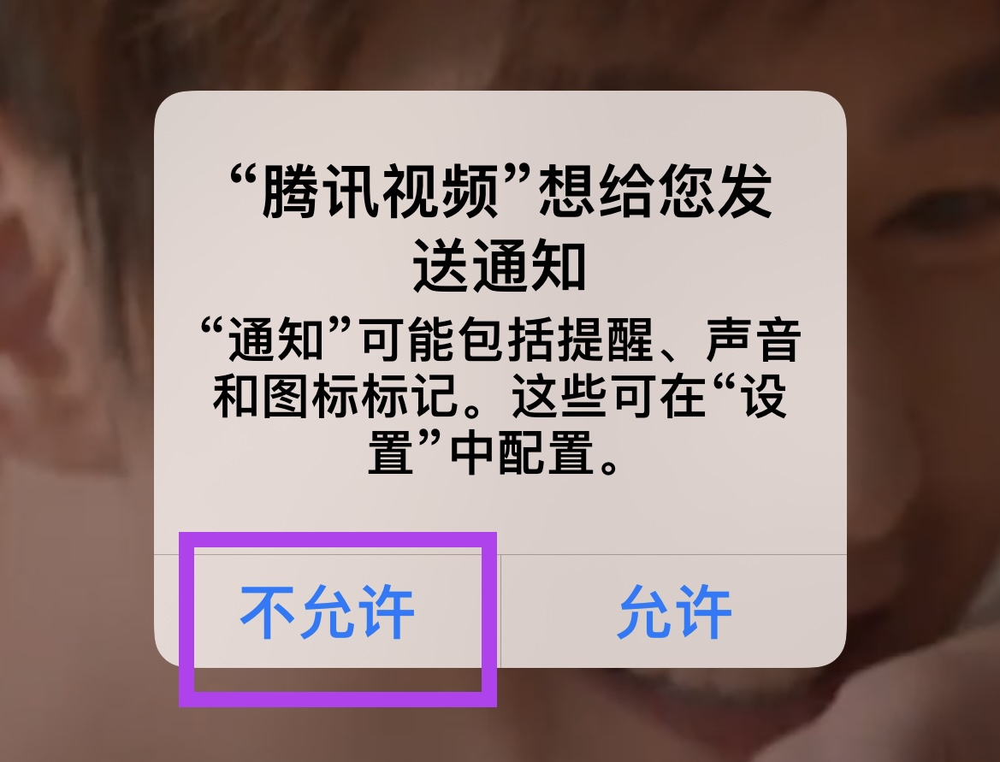

> 关于iPhone更多其它权限设置，可以参考另一篇文章 [iPhone权限设置]()

一般来说对于大部分娱乐和工具类型的APP(应用程序)都是可以不开启通知权限的，这并不影响APP的正常使用。

并且对于一些娱乐类型的APP，推送的内容质量并不高，并且很多都是广告，完全没有必要开启通知。
还有些APP通知很多，每条通知都会响，比较影响其它正常APP的正常使用，这种情况也可以单独关闭某个APP的声音通知。

在新安装APP之后，第一次打开使用的时候，一般都会有一个权限的提示 **"某某"想给您发送通知**，这个时候可以直接选择左侧的 **不允许** 即可。

如果想更改是否允许某个APP发通知，或者想单独设置通知静音等，则可以按照下面的步骤进行设置。

1. 在手机桌面找到并打开 **设置**
  
   

2. 有很多种方式找到某个APP的通知设置页面

   - 如果知道要设置的APP的名字，则可以在 **设置页面** 最上方搜索APP名字，打开之后再找到 **"通知"** 并点击打开

     
  
   - 如果想查看并且修改很多APP的通知设置，则可以在 **设置页面** 中找到并打开 **"通知"**，就会看到一系列的APP列表和通知状态，则可以选择某个APP进行设置
   
     

3. 然后就到了最后也是最重要的一步

   - 如果想关闭或者打开该APP的通知，则可以直接用页面最上方的 **"允许通知"** 开关
   
   - 如果想关闭或者打开该APP的声音通知，也就是有通知的时候手机会不会响，则可以用页面下方的 **"声音"** 开关来调节
   
   - 当然也可以修改APP的提醒方式：**"锁定屏幕"** 控制锁屏时能不能看到通知条，**"通知中心"** 控制能否在手机下拉页面看到通知条，而 **"横幅"** 表示在使用手机时，会不会直接在手机最上方弹出通知条。
     
   

