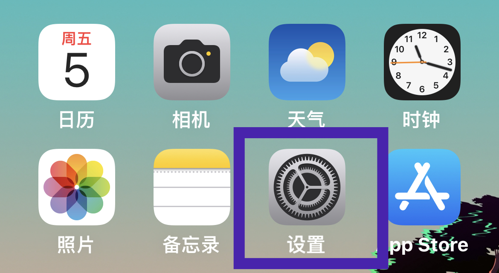
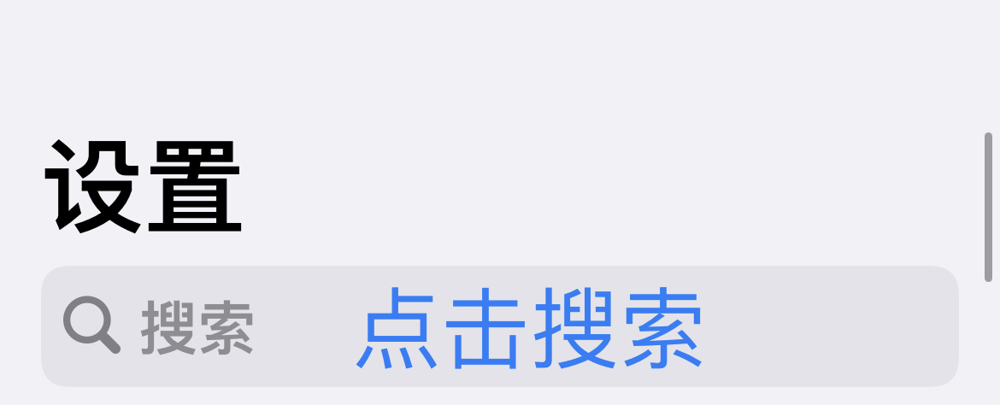
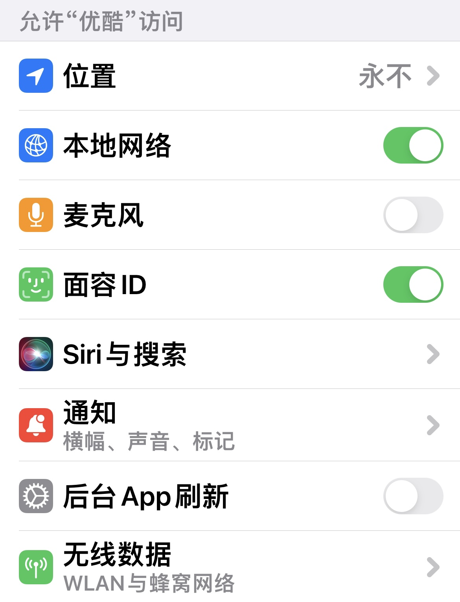

现在很多手机APP总是会索要一些并不太需要的权限，如果我们想保护好自己的隐私，就需要对这些权限格外的警惕。

如果想关掉或打开某个APP的某些权限，就可以按照下面的步骤来进行操作。

1. 在手机桌面找到并打开 **设置**

   

2. 在 **设置页面** 最上方搜索APP名字并点击打开，或者在 **设置页面** 的列表最下方找到APP并打开

   

3. 不同的APP会申请不同的权限，所以不同APP之间的权限列表有可能会不同。下面两张图片分别是小红书和优酷的权限设置页面
   
   <table style="border: none; text-align: center; width: 100%;">
   <tr style="border: none; text-align: center;">
   <td style="border: none;"></td>
   <td style="border: none;"></td>
   </tr>
   </table>

4. 接下来可以根据自己的使用情况来给定权限

   - **位置**: 敏感的隐私数据，几乎所有APP都会申请这个权限，但是一般推荐只给微信、滴滴和地图等APP精确的位置权限。对于其它APP一律不给位置权限，或者提供非精确的位置权限。
   
   - **通讯录**: 敏感的隐私数据，一些社交APP会申请这个权限，但是一般建议关闭。除非确实需要使用上传整个通讯录来推荐好友这个功能。
   
   - **照片**: 对于微信和微博等需要分享照片的APP之前，一般可以关闭照片权限。
   
   - **本地网络**: 一般会使用到电视投屏的视频软件都需要该权限，一般可以开启。
   
   - **麦克风**: 对于有语音通话功能的APP可以打开麦克风权限，还有一些内置语音助手功能的APP也会需要。一般可以开启。
   
   - **相机**: 对于有扫码、拍照、视频通话功能的APP可以打开相机权限。一般可以开启。
   
   - **无线数据**: 对于需要上网的APP例如社交和娱乐软件，都需要开启该权限。一般可以开启。
   
   - **面容ID**: 需要使用iPhone内置的人脸解锁功能，就需要开启该权限。一般都可以开启，即使开启了APP也获取不到具体的人脸数据，只有验证的结果。
   
   - **通知**: 一般只给微信、短信、新闻等需要即时通知的，个人关注的APP开启通知权限。更多通知设置可以参考另一篇文章 [iPhone通知设置]()
  
   - **后台APP刷新**: 一般可以给常用的社交APP打开。打开后台刷新APP从后台打开刷新新消息比较快，关闭后台刷新手机会更省电。

