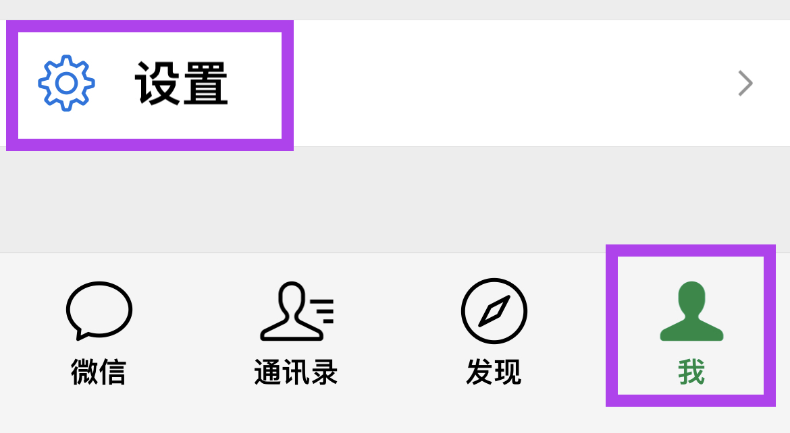
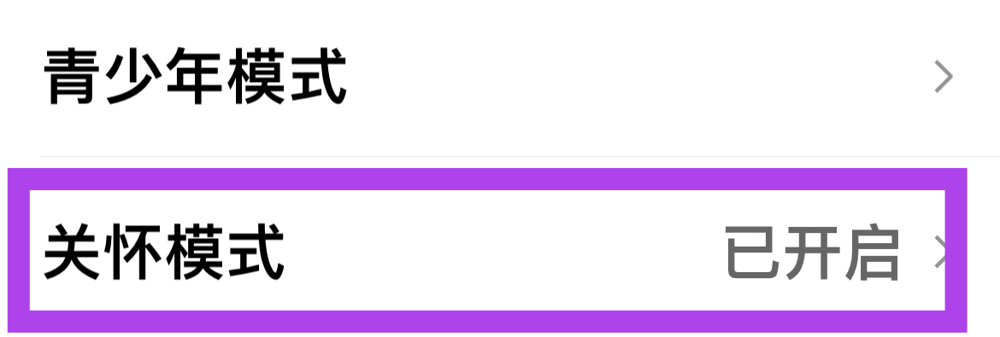
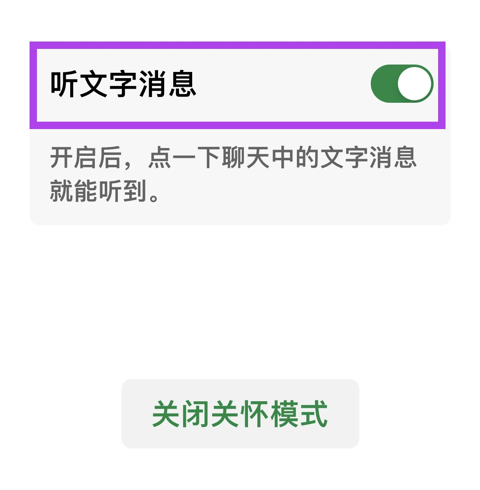

打开微信的**关怀模式**，可以直接在微信内使用更大的字体和按钮。并且也可以选择打开**听文字消息**的功能，这样就可以直接播放文字消息，可以避免过度用眼导致疲劳。

1. 首先切换到 **"我"**，然后找到并打开 **"设置"**
   

2. 找到 **"通用"** 并点击进入
   

3. 找到 **"关怀模式"** 进入设置页面。如果已经开启关怀模式，则这一行的最右侧会显示 **"已开启"**
   

4. 如果尚未开启关怀模式，则在页面的最下方，点击 **"开启"** 按钮即可
   

5. 开启关怀模式后，也可以手动打开 **"听文字消息"** 开关，这样就可以直接点击聊天中的文字来听消息了。
   

当然，如果想关闭关怀模式，可以直接点击页面下方的 **"关闭关怀模式"** 按钮。
