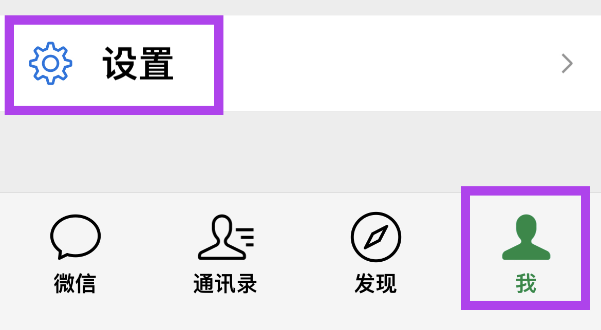
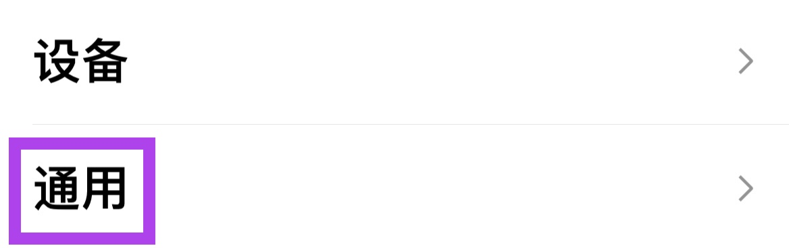
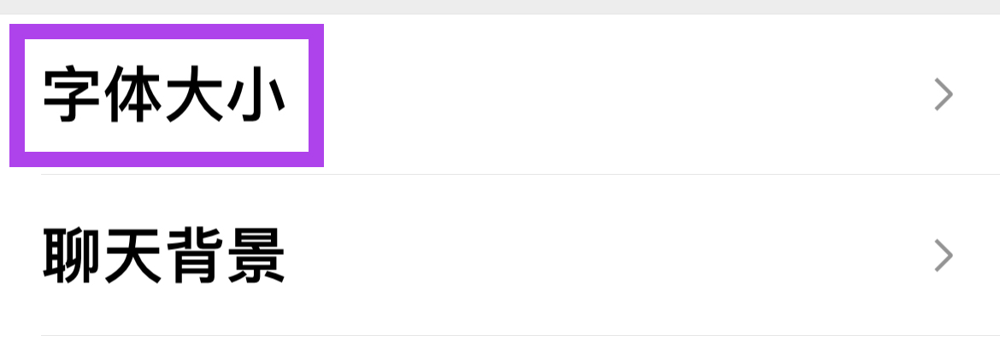
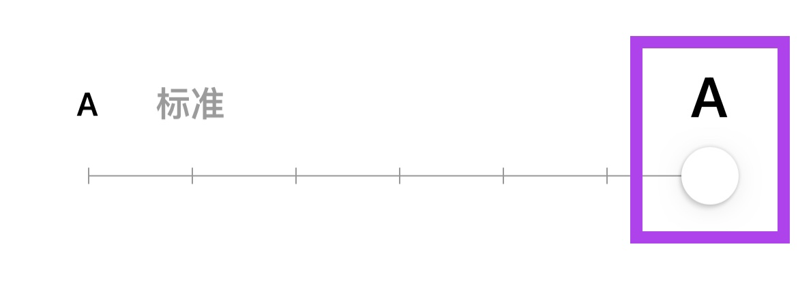

在开始设置之前，如果想使用最大号的字体，可以直接尝试**开启[关怀模式]()**，在关怀模式下字体和按钮的大小都会更适合，并且可以同时打开听文字消息功能。

如果只是想调整微信字体大小，那可以继续下面的步骤来进行设置：

1. 首先切换到 **"我"**，然后找到并打开 **"设置"**
   

2. 找到 **"通用"** 并点击进入
   

3. 找到 **"字体大小"** 并点击进入设置页面
   

4. 在页面的**最下面**，有一个可与拖动的圆形滑块，**向右拖动字体变大**，向左拖动字体变小
   

在上述调整的同时，可以看到屏幕上面的字在随之变化，选择合适的大小即可。
